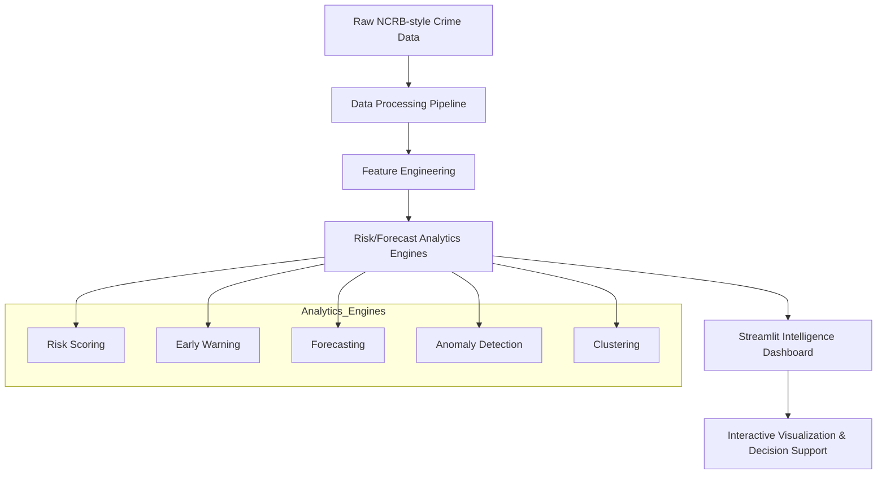

# 🛰️ CrimeWatch AI – Sovereign Intelligence HUD

[](LICENSE)
[](https://www.python.org)
[](https://crimewatch-india-ai.streamlit.app)
[](https://github.com/rajasvamshi/crimewatch-india-AI)

> **Live Demo**: [https://crimewatch-india-ai.streamlit.app](https://crimewatch-india-ai.streamlit.app)

---

## 📋 Table of Contents
- [Overview](#-overview)
- [Key Features](#-key-features)
- [Technology Stack](#-technology-stack)
- [Architecture](#-architecture)
- [Project Structure](#-project-structure)
- [Installation](#-installation)
- [Usage](#-usage)
- [Dataset](#-dataset)
- [Ethical Disclaimer](#-ethical-disclaimer)
- [Future Improvements](#-future-improvements)
- [Contributing](#-contributing)
- [License](#-license)
- [Author](#-author)

---

## 🎯 Overview

**CrimeWatch AI** is an interactive crime intelligence command center that transforms nationwide crime datasets into actionable decision-support analytics for monitoring risk patterns, detecting anomalies, and identifying high-risk regions.

The system simulates a strategic intelligence dashboard used for situational awareness and policy analysis, designed with a cinematic tactical HUD interface for mission-critical decision support.

### What It Does
- 🔍 Processes district-level crime data across 30 Indian states
- 📊 Visualizes temporal trends, regional risk concentration, and anomaly patterns
- 🚨 Detects early warning signals and emerging crime spikes
- 📈 Provides predictive insights using statistical forecasting models
- 🎛️ Offers an intuitive command-center interface for rapid interpretation

---

## ✨ Key Features

### Interactive Intelligence Dashboard
Filter and explore crime data by:
- 📅 Year range (2017-2022)
- 📍 State and district
- 🔍 Crime category (Theft, Assault, Cyber Crime, etc.)

### Analytics & Intelligence Engines
| Feature | Description |
|---------|-------------|
| **Crime Trend Analysis** | Visualize historical trends with interactive Plotly charts |
| **Risk Scoring** | Composite risk scores (Volume + Growth + Volatility) |
| **Early Warning Signals** | Rule-based spike detection + IsolationForest anomaly detection |
| **Forecast Engine** | ARIMA/Linear forecasting with confidence intervals |
| **Patrol Prioritization** | Resource-constrained unit allocation recommendations |
| **Prevention Strategies** | Category-specific actionable recommendations |

### Enterprise-Grade UI
- 🎨 Cinematic tactical HUD theme with glassmorphism effects
- 📡 Live pulse simulation for streaming feed emulation
- 🔒 Audit logging and export guards for governance
- ⚖️ Ethical AI compliance notices and human-in-the-loop reminders

---

## 🛠 Technology Stack

| Layer | Technology |
|-------|-----------|
| **Language** | Python 3.10+ |
| **Framework** | Streamlit |
| **Data Processing** | Pandas, NumPy |
| **Machine Learning** | Scikit-learn, Statsmodels, XGBoost |
| **Visualization** | Plotly, Plotly Express |
| **Geospatial** | GeoJSON, PyShp |
| **Deployment** | Streamlit Community Cloud |
| **Version Control** | Git + GitHub |
| **Containerization** | Docker (optional) |

---

## 🏗 Architecture



## 📁 Project Structure

```text
crimewatch-india-AI/
│
├── app/
│   ├── dashboard.py          # Main Streamlit application (~4,500 lines)
│   ├── assets/               # GeoJSON and static assets
│   └── scripts/              # Utility scripts
│
├── data/
│   ├── geo/                  # Geospatial boundary files
│   ├── processed/            # Cleaned master dataset
│   └── raw/                  # Source NCRB-style CSVs
│
├── src/
│   ├── build_master_dataset.py
│   ├── build_master_dataset_v2.py
│   ├── config.py
│   └── data_loader.py
│
├── notebooks/
│   └── 01_exploration_india.ipynb
│
├── Dockerfile
├── requirements.txt
├── README.md
├── LICENSE
├── ETHICAL_USE.md
└── .gitignore
```

## 🚀 Installation

### Prerequisites

Make sure the following tools are installed:

- **Python 3.10 or higher**
- **pip** (Python package manager)
- **Git**

---

### Step-by-Step Setup

#### 1️⃣ Clone the Repository

```bash
git clone https://github.com/rajasvamshi/crimewatch-india-AI.git
cd crimewatch-india-AI
```

---

#### 2️⃣ Create a Virtual Environment

**Windows**

```bash
python -m venv .venv
.venv\Scripts\activate
```

**macOS / Linux**

```bash
python -m venv .venv
source .venv/bin/activate
```

---

#### 3️⃣ Install Dependencies

```bash
pip install -r requirements.txt
```

---

#### 4️⃣ Run the Streamlit Application

```bash
streamlit run app/dashboard.py
```

---

#### 5️⃣ Open the Application in Your Browser

```
http://localhost:8501
```

Once launched, the **CrimeWatch AI dashboard** will automatically open in your browser.

---

# 🎮 Usage

## Getting Started

1. Launch the dashboard using the installation steps above.
2. Use the **Control Panel** to filter the dataset by:
   - Year range
   - State
   - District
   - Crime category
3. Explore the **interactive analytics modules** available in the dashboard.

---

## 📊 Dashboard Modules

The platform includes multiple intelligence and analytics panels:

| Module | Description |
|------|------|
| 📌 Overview | Temporal trends and category breakdown |
| 🔥 Hotspots & Risk | Risk-scoring table with district drill-down |
| 🎯 Drilldown | Navigate **State → District → Category → Crime Type** |
| 🧊 Heatmaps | District × Year and District × Category concentration |
| 📈 Forecast | ARIMA / Linear forecasting with confidence intervals |
| 🚨 Early Warning | Spike detection and anomaly flags |
| 🚓 Patrol Plan | Resource-constrained patrol unit allocation |
| 🛡️ Prevention Strategy | Crime-category specific recommendations |
| 🧠 Risk Prediction | Supervised ML model (RandomForest / XGBoost) |
| 🧪 Model Governance | Forecast metrics, drift monitoring, fairness checks |
| ⚖️ Ethical Auditor | Compliance notices and bias safeguards |
| 📝 Executive Report | Auto-generated markdown intelligence reports |
| 🗺️ Map & Clusters | Geo-clustering using KMeans / DBSCAN |
| 📂 Data & Export | Dataset preview with guarded export functionality |

---

## 💡 Usage Tips

- Toggle **Live Pulse** to simulate streaming data fluctuations  
- Adjust **AI Sensitivity** to tune anomaly detection thresholds  
- Use **Quick Filter Presets** for common time ranges  
- Generate reports using the **Executive Report** tab  

---

# 📊 Dataset

## Source

The dataset represents **aggregated crime statistics across Indian states and districts**, inspired by publicly available **NCRB-style crime reporting schemas**.

---

## Dataset Schema

| Column | Type | Description |
|------|------|------|
| year | int | Observation year (2017–2022) |
| state_name | str | State / Union Territory name |
| district_name | str | District name |
| category | str | Crime category |
| crime_type | str | Aggregated type (Property / Violent / Special / Other) |
| crime_count | int | Number of reported incidents |
| arrests | int | Number of arrests (derived feature) |
| lat | float | Latitude coordinate |
| lon | float | Longitude coordinate |

---

## Dataset Coverage

- **30 States / Union Territories** (29 states + Delhi)
- **766+ Districts**
- **10 Crime Categories**
- **6 Years of data (2017–2022)**

⚠️ **Note**

This demo uses **synthetic data for portability**.

Production deployments should integrate **validated NCRB datasets and official crime reporting pipelines**.

---

# ⚖️ Ethical Disclaimer

This project is intended strictly for **analytical, educational, and demonstration purposes**.

---

## ✅ Intended Uses

- Research on crime analytics methodologies
- Educational demonstrations of AI/ML in public safety
- Policy analysis and scenario planning
- Technology prototyping for decision-support systems

---

## ❌ Prohibited Uses

- Individual-level predictions or targeting
- Fully automated enforcement decisions
- Profiling based on protected characteristics (caste, religion, gender, ethnicity)
- Operational policing decisions without governance oversight

---

## Required Safeguards

Responsible deployments should include:

- **Human-in-the-loop review** for all CRITICAL-risk alerts
- **Quarterly drift and fairness audits**
- **Transparency reporting**
- **Cross-verification with local authorities**

See **ETHICAL_USE.md** for the complete ethical policy.

---

# 🚀 Future Improvements

Planned enhancements include:

### Advanced Analytics
- Interactive geospatial crime heatmaps
- Multi-year anomaly detection
- Advanced forecasting models (Prophet, LSTM)

### Infrastructure Improvements
- Database integration (PostgreSQL / MongoDB)
- FastAPI endpoints for external integrations
- Real-time data ingestion pipelines

### Platform Enhancements
- Role-based user authentication
- Mobile-responsive interface for field officers
- Export to PDF / PowerPoint reports

---

# 🤝 Contributing

Contributions are welcome.

## Development Workflow

```bash
git checkout -b feature/amazing-feature
git commit -m "Add amazing feature"
git push origin feature/amazing-feature
```

Then open a **Pull Request**.

---

## Development Guidelines

- Follow **PEP8 coding standards**
- Add **docstrings** to new functions and classes
- Include tests for new features when applicable
- Update documentation for user-facing changes

---

## Issues & Feature Requests

Use the **GitHub Issues** tab to:

- Report bugs
- Suggest features
- Propose improvements

Before opening a new issue, check if it already exists.

---

# 📄 License

This project is released under the **MIT License**.

---

### MIT License

Copyright (c) 2026 Rajavamshi Samudrala

Permission is hereby granted, free of charge, to any person obtaining a copy  
of this software and associated documentation files (the "Software"), to deal  
in the Software without restriction, including without limitation the rights  
to use, copy, modify, merge, publish, distribute, sublicense, and/or sell  
copies of the Software.

The above copyright notice and this permission notice shall be included in  
all copies or substantial portions of the Software.

THE SOFTWARE IS PROVIDED "AS IS", WITHOUT WARRANTY OF ANY KIND.

---

# 👨‍💻 Author

**Rajavamshi Samudrala**

GitHub  
https://github.com/rajasvamshi

LinkedIn  
Rajavamshi Samudrala

Email  
rajasvamshi@gmail.com

---

# 🙏 Acknowledgments

Special thanks to:

- **National Crime Records Bureau (NCRB)** for open data inspiration  
- **Streamlit** for the dashboard framework  
- **Plotly** for interactive visualizations  
- **Scikit-learn, Statsmodels, and XGBoost** for machine learning capabilities  
- The **open-source community** whose tools made this project possible
